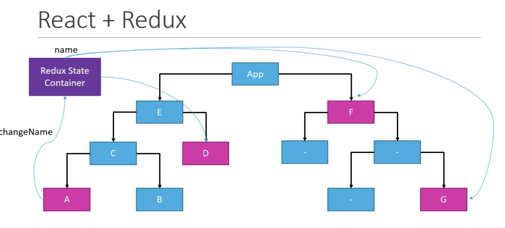
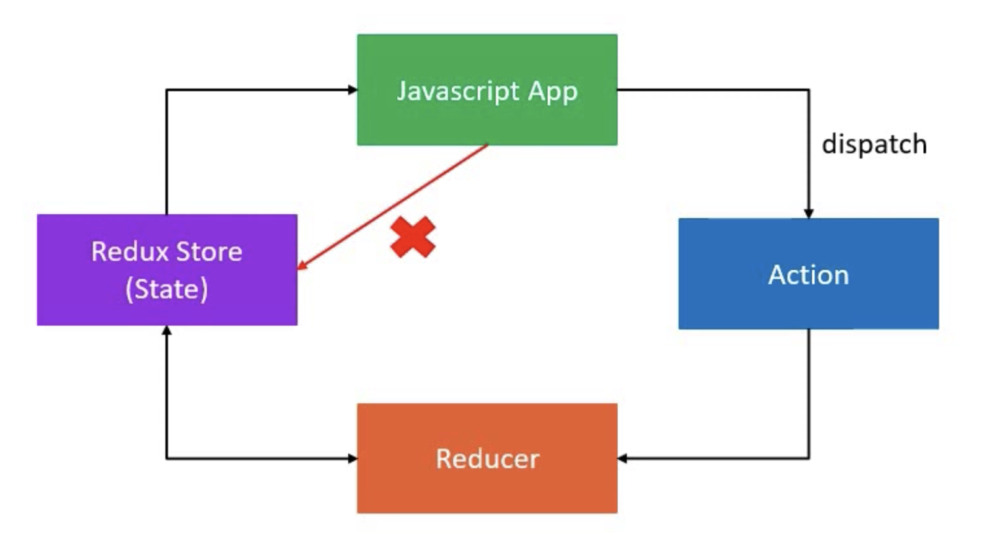
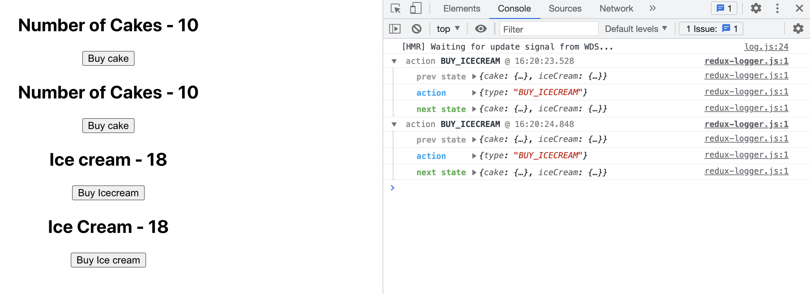
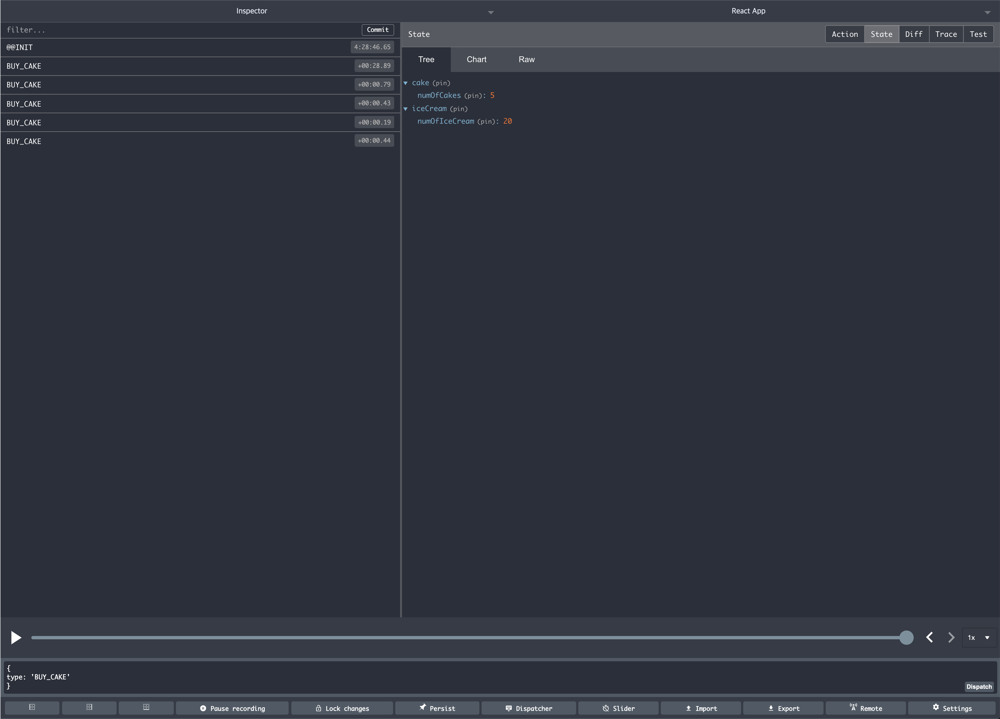

# Redux

- Redux is not tied to react, but can be used in React, angular, and vue
- Redux is a state container :arrow_right: redux stores the state of the application. This will store and manage the application state
- Redux, all state transitions are explicit so it is possible to keep track of them. The changes to the application's state become predictable
- **Predictable state container for Javascript apps**

####React + Redux is useful because...


- React app is working as nested components

#### Problem of Redux

- React context - prevents prop drilling
- useContext + useReducer

---

1. [ Getting Started ](#gettingstarted)
2. [ Three Core Concept ](#concepts)
3. [ Combined Reducers ](#combinedreducers)
4. [ Middleware ](#middleware)
5. [ Async ](#async)
6. [ React-redux ](#reactredux)
7. [ React-redux + Hooks ](#reactreduxhooks)
8. [ React-redux + Logger Middleware ](#reactlogger)
9. [ Redux Devtool Extension ](#devtool)
10. [ Payload ](#payload)
11. [ mapStateToProps ](#mapstatetoprops)
12. [ mapDispatchToProps ](#mapdispatchtoprops)
13. [Async - React](#asyncreact)

<a name="gettingstarted"></a>

## Getting Started

```
npm i redux
yarn add redux
```

<a name="concepts"></a>

## Three Core Concept

| Cakeshop scenerio       | Redux   | Purpose                             |
| ----------------------- | ------- | ----------------------------------- |
| Shop                    | Store   | Holds the state of the application  |
| Intention to buy a cake | Action  | Describes what heappend             |
| Shopkeeper              | Reducer | Ties the store and actions togeterh |

- **store**: holds the state of the apliation
- **action**: the changes in the state of the applicaiton
- **reducer**: that actually carreis out the state transition depending on the action

:arrow_right: The state of the whole application is stored in an object three within a single store

:arrow_right: The only way to change the state is to emit an action, an object describing what happend

:arrow_right: To specify how the state tree is transformed by actions, you write pure reducers



```js
const redux = require("redux");
const createStore = redux.createStore;

console.log("redux demo");

const BUY_CAKE = "BUY_CAKE";

// Action creator: a function that returns action
function buyCake() {
  // action: object with the type property
  return {
    type: BUY_CAKE,
    info: "First redux action",
  };
}

//========================================================

// (previousState, action) => newState
const initialState = {
  numOfCakes: 10,
};

// Reducer function: takes initial state and returns the state after it is updated
const reducer = (state = initialState, action) => {
  switch (action.type) {
    case BUY_CAKE:
      return {
        ...state,
        numOfCakes: state.numOfCakes - 1,
      };
    default:
      return state;
  }
};

//========================================================

// Store: holds the application state,
//        allows access to state (getState())
//        allows the state to be updated (dispatch(action)) and
//        registers listeners (subscribe(listener))
//        handles unregistering of listeners (function returned by subscribe(listener))

// createStore: takes reducer as a parameter
// create redux store
const store = createStore(reducer);
console.log("Initial state: ", store.getState());

// register
const unsubscribe = store.subscribe(() =>
  console.log("Updated state", store.getState())
);

// update state
store.dispatch(buyCake());
store.dispatch(buyCake());
store.dispatch(buyCake());
console.log("Initial state: ", store.getState());

// unregister
unsubscribe();
```

<a name="combinedreducers"></a>

## Combined Reducers

```js
const rootReducer = combinedReducers({
  cake: cakeReducers,
  iceCream: iceCreamReducers,
});

const store = createStore(rootReducer);
```

###### Examples

```js
const redux = require("redux");
const createStore = redux.createStore;
const combineReducers = redux.combineReducers;

console.log("redux demo");

const BUY_CAKE = "BUY_CAKE";
const BUY_ICECREAM = "BUY_ICECREAM";

// Action creator: a function that returns action
function buyCake() {
  // action: object with the type property
  return {
    type: BUY_CAKE,
    info: "First redux action",
  };
}
function buyIcecream() {
  // action: object with the type property
  return {
    type: BUY_ICECREAM,
    info: "First redux action",
  };
}

// (previousState, action) => newState
const initialCakeState = {
  numOfCakes: 10,
};
const initialIcecreamState = {
  numOfIcecream: 20,
};

// Reducer function: takes initial state and returns the state after it is updated
const cakeReducer = (state = initialCakeState, action) => {
  switch (action.type) {
    case BUY_CAKE:
      return {
        ...state,
        numOfCakes: state.numOfCakes - 1,
      };
    default:
      return state;
  }
};

const icecreamReducer = (state = initialIcecreamState, action) => {
  switch (action.type) {
    case BUY_ICECREAM:
      return {
        ...state,
        numOfIcecream: state.numOfIcecream - 1,
      };
    default:
      return state;
  }
};

// Store: holds the application state,
//        allows access to state (getState())
//        allows the state to be updated (dispatch(action)) and
//        registers listeners (subscribe(listener))
//        handles unregistering of listeners (function returned by subscribe(listener))

// createStore: takes reducer as a parameter
// create redux store
const rootReducer = combineReducers({
  cake: cakeReducer,
  icecream: icecreamReducer,
});
const store = createStore(rootReducer);
console.log("Initial state: ", store.getState());

// register
const unsubscribe = store.subscribe(() =>
  console.log("Updated state: ", store.getState())
);

// update state
store.dispatch(buyCake());
store.dispatch(buyCake());
store.dispatch(buyCake());
store.dispatch(buyIcecream());
store.dispatch(buyIcecream());
console.log("Initial state: ", store.getState());

// unregister
unsubscribe();
```

<a name="middleware"></a>

## Middleware

- the suggested way to extend Redux with custom functionality
- provides a third-party etension point between dispatching an action, and the moment it reaches the reducer
- Use for **logging**, **crash reporting**, **performing asychronous tasks**

```
npm i redux-logger
```

```js
// import redux-logger
const reduxLogger = require("redux-logger");

// create logger
const logger = reduxLogger.createLogger();

// apply middleware in redux
const applyMiddleware = redux.applyMiddleware;

...
...

// input middle ware as a parameter
const store = createStore(rootReducer, applyMiddleware(logger));
// register but do not need any log, since redux-logger will automatically generate the log
const unsubscribe = store.subscribe(() => {});

```

###### output

```
Middleware
Initial state:  { cake: { numOfCakes: 10 }, icecream: { numOfIcecream: 20 } }
 action BUY_CAKE @ 14:24:22.209
   prev state { cake: { numOfCakes: 10 }, icecream: { numOfIcecream: 20 } }
   action     { type: 'BUY_CAKE', info: 'First redux action' }
   next state { cake: { numOfCakes: 9 }, icecream: { numOfIcecream: 20 } }
 action BUY_CAKE @ 14:24:22.210
   prev state { cake: { numOfCakes: 9 }, icecream: { numOfIcecream: 20 } }
   action     { type: 'BUY_CAKE', info: 'First redux action' }
   next state { cake: { numOfCakes: 8 }, icecream: { numOfIcecream: 20 } }
 action BUY_CAKE @ 14:24:22.211
   prev state { cake: { numOfCakes: 8 }, icecream: { numOfIcecream: 20 } }
   action     { type: 'BUY_CAKE', info: 'First redux action' }
   next state { cake: { numOfCakes: 7 }, icecream: { numOfIcecream: 20 } }
 action BUY_ICECREAM @ 14:24:22.211
   prev state { cake: { numOfCakes: 7 }, icecream: { numOfIcecream: 20 } }
   action     { type: 'BUY_ICECREAM', info: 'First redux action' }
   next state { cake: { numOfCakes: 7 }, icecream: { numOfIcecream: 19 } }
 action BUY_ICECREAM @ 14:24:22.211
   prev state { cake: { numOfCakes: 7 }, icecream: { numOfIcecream: 19 } }
   action     { type: 'BUY_ICECREAM', info: 'First redux action' }
   next state { cake: { numOfCakes: 7 }, icecream: { numOfIcecream: 18 } }
Initial state:  { cake: { numOfCakes: 7 }, icecream: { numOfIcecream: 18 } }
```

<a name="async"></a>

## Async

- Async API calls, fetch data will not work as synchronous way

###### state

```
state = {
    loading: true,
    data: [],
    error: ''
}
```

###### actions

```
FETCH_REQUEST - fetch list of data
FETCH_SUCCESS - fetch successful
FETCH_ERROR - fetch unsuccessful
```

###### reducers

```
case: FETCH_REQUEST
    loading: true
case: FETCH_SUCCESS
    loading: false
    data: data(from API)
case: FETCH_ERROR
    loading: false
    error: error(from API)
```

- to request an API end point: `axios`
- Define async action creator: `redux-thunk`

```
npm i axios
npm i redux-thunk
```

###### example

```js
// instead of return actions object, it allows to return a function
// so it is not stable
const fetchUsers = () => {
  return (dispatch) => {
    axios
      .get("https://jsonplaceholder.typicode.com/users")
      .then((res) => {
        // response.data is the array of users
        const users = res.data.map((user) => user.id);
        dispatch(fetchUserSuccess(users));
      })
      .catch((err) => {
        // error.message description of error
        const error = err.message;
        dispatch(fetchUsersFailure(error));
      });
  };
};

const store = createStore(reducer, applyMiddleware(thunkMiddleware));
store.subscribe(() => {
  console.log(store.getState());
});
store.dispatch(fetchUsers());
```

<a name="reactredux"></a>

## React-Redux

folder structure

```
├── public
└── src
    ├── components   # app components
    ├── redux        # everything about redux should go here
    │   ├── <object> # seperate redux as objects
    │   └── store.js # store
    └── App.js
```

```
└── redux
    ├── cake
    │   ├── cakeActions.js
    │   ├── cakeTypes.js
    │   └── cakeReducers.js
    └── iceCream
    ...
```

###### actions

```js
// cakeTypes.js
export const BUY_CAKE = "BUY_CAKE";
```

```js
// cakeActions.js
import { BUY_CAKE } from "./cakeTypes";

export const buyCake = () => {
  return {
    type: BUY_CAKE,
  };
};
```

###### reducers

```js
// cakeReducers
import { BUY_CAKE } from "./cakeTypes";

const initialState = { numOfCakes: 10 };

const cakeReducer = (state = initialState, actions) => {
  switch (actions.type) {
    case BUY_CAKE:
      return {
        ...state,
        numOfCakes: state.numOfCakes - 1,
      };

    default:
      return state;
  }
};

export default cakeReducer;
```

###### store

```js
// store.js
import { createStore } from "redux";
import cakeReducer from "./cake/cakeReducers";

const store = createStore(cakeReducer);

export default store;
```

###### Provider

`Provider`will help to store `store` as a component and child components will be able to `getState` from each components

```js
import "./App.css";
import CakeContainer from "./components/CakeContainer";

import { Provider } from "react-redux";
import store from "./redux/store";

function App() {
  return (
    <Provider store={store}>
      <div className="App">
        <CakeContainer />
      </div>
    </Provider>
  );
}

export default App;
```

###### Connect all

by using `mapStateToProps` `mapDispatchToProps` and connecting them with current component... We are able to use them as props

```js
import React from "react";
import { buyCake } from "../redux";
import { connect } from "react-redux";

function CakeContainer(props) {
  return (
    <div>
      <h2>Number of Cakes - {props.numOfCakes}</h2>
      <button onClick={props.buyCake}>Buy cake</button>
    </div>
  );
}

// Get state
const mapStateToProps = (state) => {
  return {
    numOfCakes: state.numOfCakes,
  };
};

// dispatch
const mapDispatchToProps = (dispatch) => {
  return {
    buyCake: () => dispatch(buyCake()),
  };
};

// send redux as a props in current container
export default connect(mapStateToProps, mapDispatchToProps)(CakeContainer);
```

<a name="reactreduxhooks"></a>

## React-Redux + hooks

`react-redux v7.1`, hook was added! no need for `connect()`

`useSelector` - similar to `mapStateToProps`
`useDispatch` - similar to `mapDispatchToProps`

```javascript
import React from "react";
import { useDispatch, useSelector } from "react-redux";
import { buyCake } from "../redux";

function CakeContainerHook() {
  // get state
  const numOfCakes = useSelector((state) => state.numOfCakes);
  // get dispatch
  const dispatch = useDispatch();
  return (
    <div>
      <h2>Number of Cakes - {numOfCakes}</h2>
      <button onClick={() => dispatch(buyCake())}>Buy cake</button>
    </div>
  );
}

export default CakeContainerHook;
```

<a name="reactlogger"></a>

## React-Redux + Logger Middleware

```
npm i react-logger
```

```js
// store.js
import { createStore, applyMiddleware } from "redux";
import rootReducer from "./rootReducer";

import logger from "redux-logger";

const store = createStore(rootReducer, applyMiddleware(logger));

export default store;
```



<a name="devtool"> </a>

## Redux Devtool Extension

1. <a href="https://chrome.google.com/webstore/detail/redux-devtools/lmhkpmbekcpmknklioeibfkpmmfibljd">Link to Google web store</a>
2. <a href="https://github.com/zalmoxisus/redux-devtools-extension">Link to Github link</a>
3. `npm install --save redux-devtools-extension`
4.

```js
import { createStore, applyMiddleware } from "redux";
import { composeWithDevTools } from "redux-devtools-extension";

const store = createStore(
  reducer,
  composeWithDevTools(
    applyMiddleware(...middleware)
    // other store enhancers if any
  )
);
```



<a name="payload" ></a>

## Payload

`dispatch` can have a function that takes an input

```js
<button onClick={() => dispatch(buyCakes(number))}>Buy cake</button>
```

###### actions

```js
import { BUY_CAKE } from "./cakeTypes";
import { BUY_CAKES } from "./cakeTypes";

export const buyCake = () => {
  return {
    type: BUY_CAKE,
  };
};

export const buyCakes = (cakes) => {
  return {
    type: BUY_CAKES,
    payload: cakes,
  };
};
```

###### reducers

```js
const cakeReducer = (state = initialState, actions) => {
  switch (actions.type) {
    case BUY_CAKE:
      return {
        ...state,
        numOfCakes: state.numOfCakes - 1,
      };
    case BUY_CAKES:
      return {
        ...state,
        numOfCakes: state.numOfCakes - actions.payload,
      };

    default:
      return state;
  }
};
```

<a name="mapstatetoprops"></a>

## mapStateToProps

Before, we only had a single parameter in `mapStateToProps`.
However, `mapStateToProps` can have 2 parameters.

first parameter is for the redux state.
second parameter is for the direct props from parent component

```js
import React from "react";
import { connect } from "react-redux";

function ItemContainer(props) {
  return (
    <div>
      <h2>Item - {props.item}</h2>
    </div>
  );
}

// state - regular state that is stored
// ownProps - Item container's own props
const mapStateToProps = (state, ownProps) => {
  const itemState = ownProps.cake
    ? state.cake.numOfCakes
    : state.iceCream.numOfIceCream;

  return {
    item: itemState,
  };
};

export default connect(mapStateToProps)(ItemContainer);
```

if `ItemContainer` has props with cake variable it shows `numOfCakes`, and if not it shows `numOfIceCream`

```js
//  App.js
...
<ItemContainer />           // numOfIceCream
<ItemContainer cake />      // numOfCake
...
```

<a name="mapdispatchtoprops"></a>

## mapDispatchToProps

Also, `mapDispatchToProps` can have 2 parameters.

first parameter is for the redux state.
second parameter is for the direct props from parent component

```js
const mapDispatchToProps = (dispatch, ownProps) => {
  const dispatchFunction = ownProps.cake
    ? () => dispatch(buyCake())
    : () => dispatch(buyIceCream());
  return {
    buyItem: dispatchFunction,
  };
};

export default connect(null, mapDispatchToProps)(ItemContainer);
```

<a name="asyncreact"></a>

## Async - React
