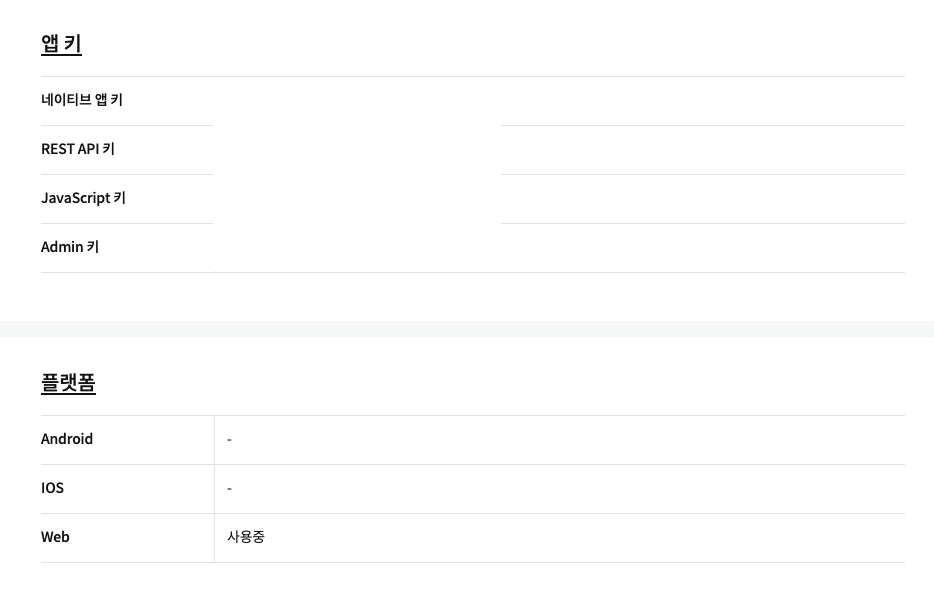

# Kakao Map API

1. <a href="https://apis.map.kakao.com/web/guide/">Guide</a>
2. <a href="https://developers.kakao.com">Kakao developers</a>
3. Application 생성 후, Javascript 키 복사 및 플랫폼 등록

4. `index.html`에 script 등록
```html
<script type="text/javascript" src="//dapi.kakao.com/v2/maps/sdk.js?appkey=%REACT_APP_KAKAOMAP_API_KEY%"></script>
```
5. `.env` 로 REACT_APP_KAKAOMAP_API_KEY 등록
`.env`는 최상위 폴더에 저장하면 되며 variable은 무조건 `REACT_APP`으로 시작해야한다.
```
REACT_APP_KAKAOMAP_API_KEY=<Kakao developer 에서 받은 JavaScript 키>
```

6. Component 생성
```js
/* global kakao */
import React, { useEffect } from "react";


function Location() {
  console.log(process.env.REACT_APP_KAKAOMAP_API_KEY);
  useEffect(() => {
    let container = document.getElementById("map");
    var options = {
      center: new kakao.maps.LatLng(37.365264512305174, 127.10676860117488),
      level: 3,
    };
    var map = new kakao.maps.Map(container, options);
  }, []);

  return (
    <div>
      <div id="map" style={{ width: "100vw", height: "100vh" }}></div>
    </div>
  );
}

export default Location;
```
- 맨 위의 `/* global kakao */` 를 제외하면 kakao를 못찾는 에러가 생성 됨으로 추가해준다. 추가해주기 싫으면 `kakao`를 `window.kakao`로 변경한다.
- `useEffect`를 이용하여 map을 생성한다.